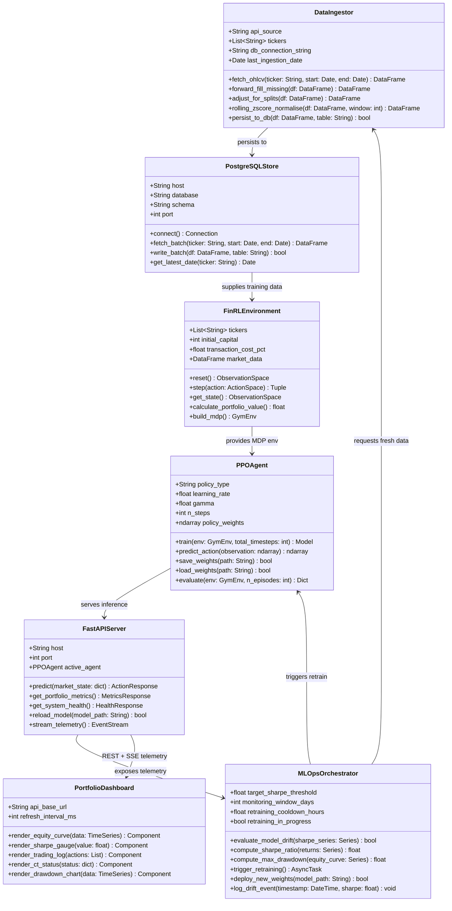

# Class Diagram

Models the static object-oriented backend structure. Implements OOAD principles with strict encapsulation, separation of concerns, and loose coupling across the four system modules.

## Diagram

## Class Descriptions

### `DataIngestor`
Responsible for the entire ETL pipeline. Connects to the yfinance API, handles missing value imputation, adjusts for corporate actions (splits, dividends), applies rolling Z-score normalisation, and persists clean data to PostgreSQL.

### `PostgreSQLStore`
The ACID-compliant persistence layer. Acts as the single source of truth for all historical and incoming market data. Exposes batch fetch methods optimised for the PPO training loop's large sequential reads.

### `FinRLEnvironment`
Wraps the FinRL library to convert PostgreSQL-stored market data into a standard OpenAI Gym-compatible Markov Decision Process. Defines the observation space (state) and action space (portfolio weights) for the PPO agent.

### `PPOAgent`
The core intelligence. Wraps Stable Baselines3's PPO implementation. Exposes `train()` for supervised training cycles and `predict_action()` for real-time inference. Handles model artifact serialisation and loading.

### `MLOpsOrchestrator`
The primary engineering contribution of this thesis. Continuously monitors the live Sharpe Ratio. On detecting drift below `target_sharpe_threshold`, it asynchronously triggers `DataIngestor` for fresh data, initiates `PPOAgent.train()`, and calls `FastAPIServer.reload_model()` — all without blocking live inference.

### `FastAPIServer`
Stateless ASGI inference gateway. Decouples the computationally heavy retraining loop from live trading inference. Exposes REST endpoints for action prediction and telemetry, plus a Server-Sent Events (SSE) stream for the React dashboard.

### `PortfolioDashboard`
The React.js SPA client. Polls the FastAPI telemetry endpoints and renders real-time equity curves, Sharpe gauges, drawdown charts, trading logs, and CT pipeline status indicators.
