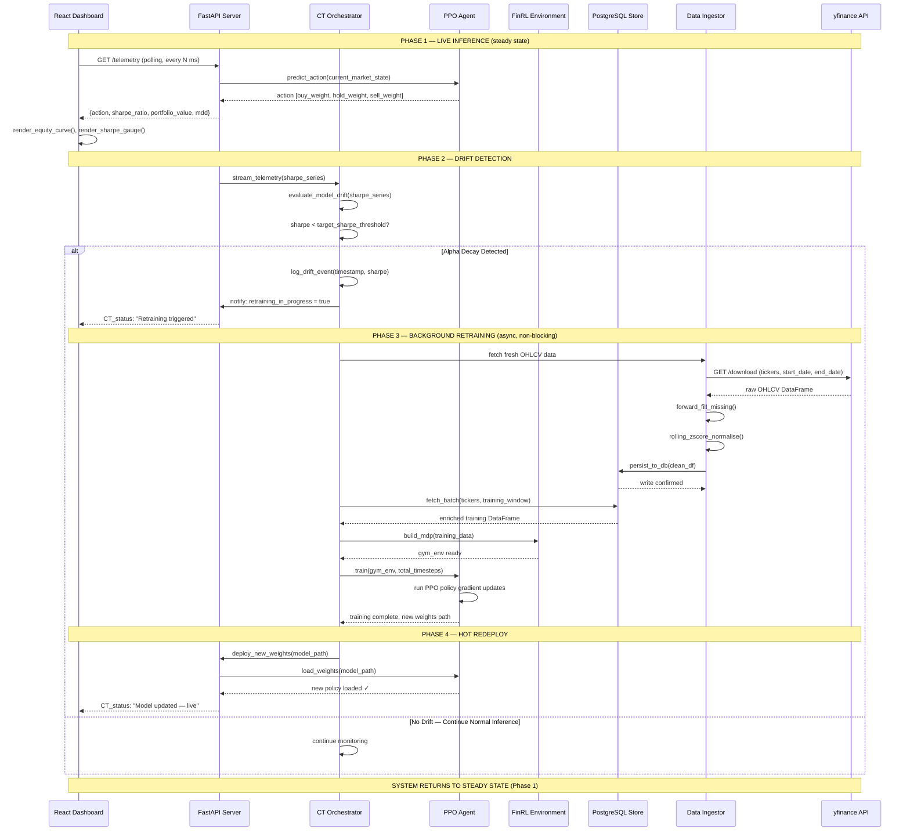

# Sequence Diagram

Illustrates the chronological flow of messages between system objects during a full **Continuous Training (CT) cycle** — from alpha decay detection through to live model redeployment.

## Full CT Loop Sequence

## Key Design Decisions Illustrated

**Non-blocking async retraining:** The FastAPI ASGI server continues serving inference requests (`predict_action`) while the CT Orchestrator runs the retraining cycle asynchronously in the background — a critical architectural requirement for system availability.

**Hot-swap deployment:** `deploy_new_weights()` atomically replaces the live model artifact without server restart or downtime, maintaining uninterrupted trading execution.

**Sharpe Ratio as the drift signal:** The orchestrator uses a rolling Sharpe Ratio time-series — not raw returns — as the primary drift detector, providing a risk-adjusted, noise-resistant signal.
