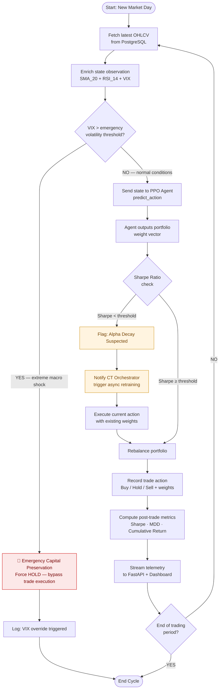
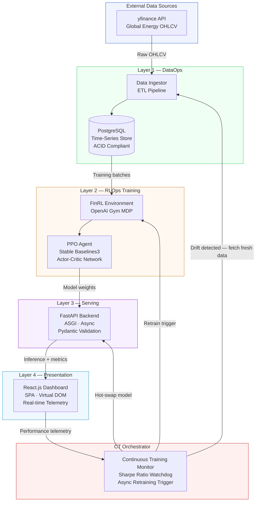

# Activity Diagram

Illustrates the system's internal control flow and decision-making logic for a single localised trading cycle, including the VIX-based emergency capital-preservation fail-safe.

## Trading Cycle Activity Flow



## Decision Logic Notes

| Decision Gate | Condition | Consequence |
|---------------|-----------|-------------|
| VIX threshold breach | VIX index exceeds predefined limit (e.g. > 35) | Trade bypassed; agent forced to HOLD; capital preserved |
| Sharpe Ratio check | Rolling Sharpe drops below `target_sharpe_threshold` | Drift flagged; CT Orchestrator notified; async retraining initiated |
| End of period | Daily cycle complete | Metrics logged; system loops to next trading day |

---

# System Architecture Diagram

Provides a layered view of the complete platform — illustrating how data flows across the four infrastructure layers and how the closed-loop CT feedback architecture operates.

## Architecture Layers



## Data Flow Summary

```
yfinance API
    → DataIngestor (ETL: clean, normalise, Z-score)
        → PostgreSQL (ACID-compliant time-series storage)
            → FinRL MDP Environment (state/action/reward definition)
                → PPO Agent (policy gradient training)
                    → FastAPI Serving Layer (stateless async inference)
                        → React.js Dashboard (real-time telemetry)
                            → CT Orchestrator (Sharpe monitoring)
                                ↺ loops back to DataIngestor on drift detection
```

## Infrastructure Separation of Concerns

| Module | Namespace | Responsibility |
|--------|-----------|---------------|
| `dataops/` | DataOps | ETL pipelines, PostgreSQL bridging, data normalisation |
| `rlops/` | RLOps | FinRL environment, Stable Baselines3 PPO, reward engineering |
| `serving/` | Serving | FastAPI gateway, Pydantic validation, CT orchestration |
| `dashboard/` | Presentation | React.js components, telemetry visualisation |
