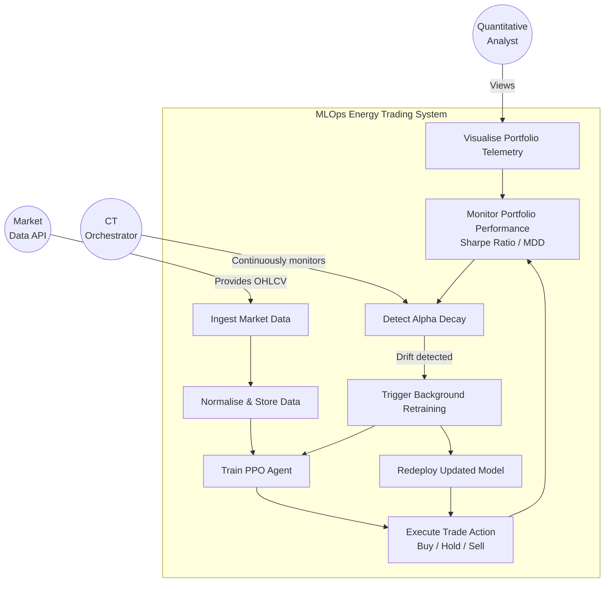

# Use Case Diagram

This diagram defines the system boundaries and illustrates the interactions between external actors and the core MLOps pipeline functionalities.

## Actors

| Actor | Description |
|-------|-------------|
| **Quantitative Analyst** | Primary end-user; monitors portfolio telemetry and system health via the React dashboard |
| **Market Data API (yfinance)** | External data source; provides daily OHLCV data for global energy equities |
| **CT Orchestrator** | Internal automated actor; monitors performance and triggers retraining autonomously |

## Diagram

## Use Case Descriptions

### UC1 — Ingest Market Data
**Actor:** Market Data API
**Description:** The system programmatically fetches daily OHLCV (Open, High, Low, Close, Volume) data for target energy equities (XOM, CVX, SHEL, BP, NEE) via the yfinance API.
**Precondition:** API connection is active.
**Postcondition:** Raw OHLCV data is available in memory for preprocessing.

### UC2 — Normalise & Store Data
**Actor:** System (DataOps Layer)
**Description:** Raw data is forward-fill imputed, adjusted for splits/dividends, and normalised via rolling Z-score standardisation before being persisted in PostgreSQL.
**Precondition:** Raw data has been ingested.
**Postcondition:** Clean, normalised data is stored in the PostgreSQL time-series database.

### UC3 — Train PPO Agent
**Actor:** System (RLOps Layer)
**Description:** The PPO agent is trained within the FinRL simulated MDP environment using historical data from PostgreSQL. Reward function penalises Maximum Drawdown.
**Precondition:** Normalised training data is available in the database.
**Postcondition:** Trained PPO model weights are serialised and saved as artifacts.

### UC4 — Execute Trade Action
**Actor:** System (PPO Agent)
**Description:** Given a market state observation, the trained PPO policy outputs a continuous action — a portfolio weight vector representing Buy / Hold / Sell allocations.
**Precondition:** Trained model is loaded and market state is available.
**Postcondition:** Trade action is executed in the simulated environment; portfolio is rebalanced.

### UC5 — Monitor Portfolio Performance
**Actor:** CT Orchestrator, Quantitative Analyst
**Description:** The system continuously evaluates risk-adjusted metrics — primarily the Sharpe Ratio and Maximum Drawdown — against predefined thresholds.
**Precondition:** Trading actions are being executed.
**Postcondition:** Performance telemetry is surfaced on the React dashboard and fed to the CT Orchestrator.

### UC6 — Detect Alpha Decay
**Actor:** CT Orchestrator
**Description:** If the live Sharpe Ratio drops below a critical threshold, the orchestrator classifies the event as model drift / alpha decay.
**Precondition:** Performance monitoring is active.
**Postcondition:** Retraining trigger is raised.

### UC7 — Trigger Background Retraining
**Actor:** CT Orchestrator
**Description:** The orchestrator fetches fresh data from PostgreSQL and initiates an asynchronous PPO retraining cycle without blocking the live inference server (FastAPI ASGI).
**Precondition:** Alpha decay has been detected.
**Postcondition:** New model weights are being trained in the background.

### UC8 — Redeploy Updated Model
**Actor:** System (Serving Layer)
**Description:** Upon successful retraining, the FastAPI backend hot-swaps the live model artifact with the newly trained weights without server downtime.
**Precondition:** Retraining cycle has completed successfully.
**Postcondition:** Live inference is now served by the updated PPO model.

### UC9 — Visualise Portfolio Telemetry
**Actor:** Quantitative Analyst
**Description:** The React.js SPA surfaces real-time equity curves, Sharpe Ratio graphs, trading activity logs, drawdown gauges, and CT pipeline status indicators.
**Precondition:** FastAPI serving layer is active and returning telemetry data.
**Postcondition:** Analyst has full observability into portfolio health and system status.
